# wallpapers

Fifteen hand-picked dark wallpapers rendered from full-resolution sources,
packaged as a Nix flake. Every wallpaper ships in two variants:

| set          | resolution | aspect | how it is made                                              |
|--------------|------------|--------|-------------------------------------------------------------|
| `ultrawide`  | 5120×2160  | 21:9   | Lanczos scale-to-fill + centre crop of the original          |
| `widescreen` | 3840×2160  | 16:9   | lossless crop of the ultrawide frame (centred unless noted)  |

The PNGs are lossless, 8-bit sRGB, no alpha, and are attached to GitHub
releases. The flake fetches them by content hash, so the repository itself
stays small.

<table>
<tr><td align="center">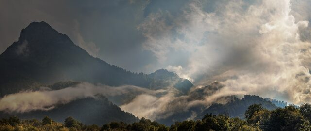<br><code>mountains-mist-clouds</code><br><sub>Caucasus mountains wrapped in mist and clouds</sub></td><td align="center">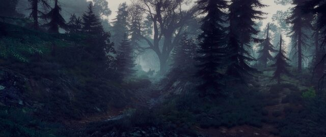<br><code>witcher-dark-forest</code><br><sub>The Witcher 3: Geralt in a dark misty forest</sub></td><td align="center">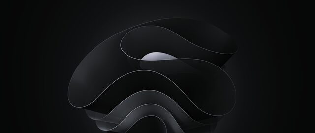<br><code>abstract-dark-waves</code><br><sub>Windows 11 style black abstract waves, centered</sub></td></tr>
<tr><td align="center">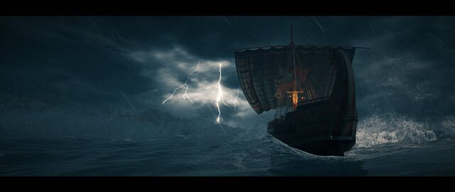<br><code>ship-storm-lightning</code><br><sub>Assassin's Creed Odyssey: ship in a lightning storm (letterboxed source)</sub></td><td align="center">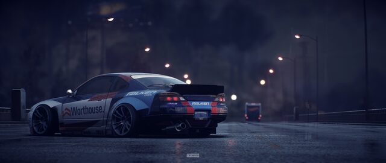<br><code>silvia-s15-night-rain</code><br><sub>Need for Speed: Nissan Silvia S15 on a rainy night road</sub></td><td align="center">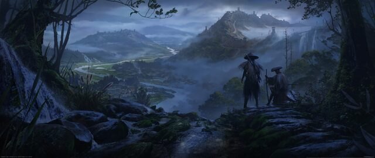<br><code>ronin-valley-mist</code><br><sub>Assassin's Creed Shadows: two ronin above a misty valley</sub></td></tr>
<tr><td align="center">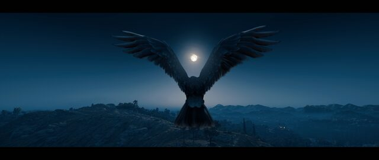<br><code>eagle-full-moon</code><br><sub>Assassin's Creed Odyssey: eagle against the full moon (letterboxed source)</sub></td><td align="center">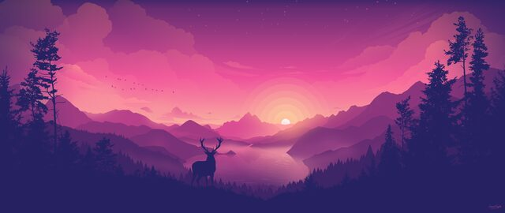<br><code>deer-pink-sunset</code><br><sub>Flat vector deer at a pink and purple sunset</sub></td><td align="center"><br><code>ina-sunset-lake</code><br><sub>Ninomae Ina'nis and Takodachi on a mirror lake at sunset</sub></td></tr>
<tr><td align="center">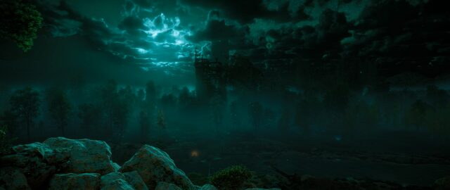<br><code>horizon-teal-moonlight</code><br><sub>Horizon Zero Dawn: ruins under teal moonlight</sub></td><td align="center">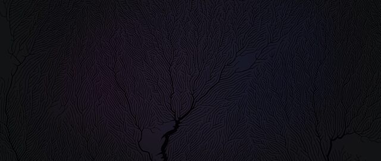<br><code>abstract-dark-branches</code><br><sub>Near-black minimal abstract with branching veins</sub></td><td align="center">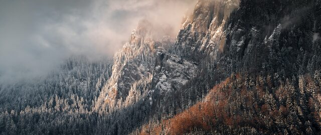<br><code>mountains-snow-forest</code><br><sub>Snow-dusted mountain slopes with autumn forest and fog</sub></td></tr>
<tr><td align="center">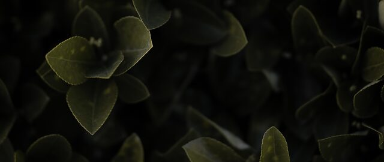<br><code>leaves-dark-closeup</code><br><sub>Low-light close-up of green leaves</sub></td><td align="center">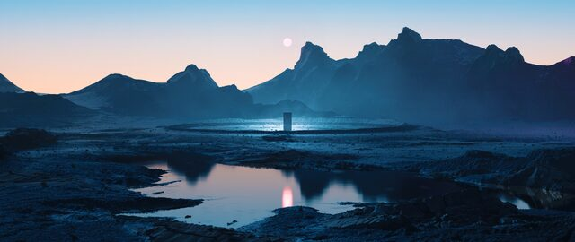<br><code>monolith-lake-sunset</code><br><sub>Surreal monolith over a mountain lake at sunset</sub></td><td align="center">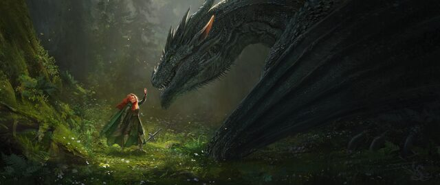<br><code>dragon-forest-fantasy</code><br><sub>Red-haired woman meets a dragon in a green forest</sub></td></tr>
</table>

## Usage

Add the flake as an input:

```nix
inputs.wallpapers = {
  url = "github:madprogrammer/wallpapers";
  inputs.nixpkgs.follows = "nixpkgs";
};
```

Then pick a wallpaper by set and name:

```nix
# directly
wallpaper = inputs.wallpapers.legacyPackages.${pkgs.system}.ultrawide.mountains-mist-clouds;

# or through an overlay that aliases pkgs.inputs.<flake> to its legacyPackages
wallpaper = pkgs.inputs.wallpapers.widescreen.ronin-valley-mist;
```

Each derivation is a single PNG file, so it can be used anywhere a path is
expected (`stylix.image`, `swaybg -i`, `swaylock -i`, hyprpaper, ...). It also
carries `passthru.wallpaper`, `.variant`, `.resolution`, `.aspect`,
`.description` and `.source`.

From the command line:

```sh
nix build github:madprogrammer/wallpapers#mountains-mist-clouds-5120x2160
nix build github:madprogrammer/wallpapers          # link farm of every variant
```

## Adding or re-rendering wallpapers

1. Put the full-resolution originals in a directory as `wallhaven-<id>.<ext>`
   and describe them in [`wallpapers/list.json`](wallpapers/list.json):
   `name`, `description`, `source` (the wallhaven page, its id is used to find
   the original), optional `origin` (artist's page) and optional `widescreen_x`
   (left edge of the 3840-wide crop inside the 5120-wide frame; default 640).
2. Render: `scripts/generate.sh <originals-dir> out` (ImageMagick 7, jq).
3. Publish: `scripts/release.sh <tag> out` uploads the PNGs to a GitHub
   release and writes their URLs and SRI hashes back into `list.json`.
4. Commit `list.json` (and a preview in `previews/` if you like).

## Credits

All artwork belongs to its respective authors; the `source` field of every
entry links to the wallhaven page it was taken from, and `origin` to the
artist's page where known.
